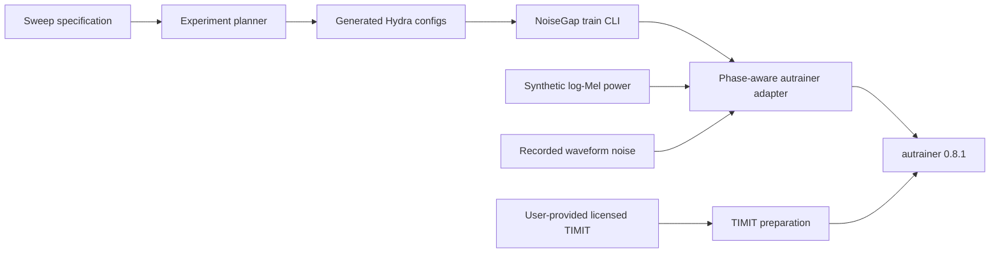

# NoiseGap

NoiseGap is an auditable experiment layer for measuring how a classifier trained
under one log-Mel noise condition behaves under another.

## Evidence boundary

The historical files in the source repository do **not** validate this
implementation:

- `analysis_results/summary_report.txt` was generated on 2025-12-01 for SNR levels
  `[-20, 0, 20]`.
- Noise mixing changed after that report, on 2025-12-04, 2025-12-07, and
  2026-04-13.
- The later sweep uses `[-5, 0, 10, 20, 30, 40]`.
- The old recorded-noise code transposed time and mel semantics implicitly. It
  could hit the requested aggregate SNR while destroying the recorded temporal
  structure.

Therefore this repository currently makes no accuracy, robustness, or speedup
claim. New claims require fresh runs whose resolved config, code revision,
checkpoint, metrics, and analysis output are retained together.

Every training or evaluation run writes `noisegap_provenance.json` beside its
outputs. It records the resolved-config SHA-256, protocol fields, dependency
versions, Git revision, and whether the checkout was dirty.

## Architecture



The internal tensor contract is always `[channel, time, mel]`. Recorded waveform
noise is converted with the same pinned PANN log-Mel parameters as speech
(`16 kHz`, `512`-sample window, `160`-sample hop, `64` bins, `50–8000 Hz`) and
then mixed in linear-power space.

Reported SNR is a feature-space quantity: mean speech power divided by mean added
noise power over non-zero (non-padding) log-Mel bins. It is not waveform SNR.
Zero-padded frames remain byte-for-byte unchanged.

## Data policy

TIMIT is distributed by the Linguistic Data Consortium as `LDC93S1` under an LDC
user agreement. NoiseGap does not download or redistribute it. Supply a licensed
local copy:

```bash
uv sync --frozen
uv run noisegap-prepare-timit \
  --source /path/to/TIMIT \
  --output data/TIMIT-sentence-type

uv run autrainer preprocess \
  --config-dir conf \
  --config-name noisegap_base
```

The default split policy keeps the official TIMIT `TEST` tree as test data and
creates the development set from speakers in the official `TRAIN` tree. This is
not directly comparable with the legacy random 70/15/15 split over all speakers.

Recorded-noise WAV files are likewise user-supplied and are never downloaded or
redistributed. Each CSV must contain one unique `path` per row, relative to
`--recorded-root`; missing, duplicate, absolute, or escaping paths fail closed.

## Generate an experiment matrix

```bash
uv run noisegap-generate \
  --output generated/audioset \
  --recorded-root data/AudioSet-Balanced-Noise \
  --recorded-train-csv data/AudioSet-Balanced-Noise/train.csv \
  --recorded-test-csv data/AudioSet-Balanced-Noise/test.csv
```

With two domains and six SNR levels this produces a manifest with 12 diagonal
training runs and 132 checkpoint-reuse evaluations. Generated files are ignored by
Git; the specification and generator are the source of truth. Each evaluation
config points directly to the `_best/model.pt` produced by its corresponding
diagonal training config.

Run a generated config by adding its directory to Hydra's search path:

```bash
uv run noisegap-train \
  --config-dir generated/audioset/configs \
  --config-name train_SS_train-5_test-5
```

Run this command from the repository root. From another working directory, set
`NOISEGAP_CONFIG_DIR` to the absolute path of this repository's `conf` directory.
Training configs must finish before evaluations that reference their checkpoint.
The generated `manifest.json` is train-first and gives every evaluation an
explicit `depends_on` training config.

Run the complete train-first DAG, or one phase:

```bash
uv run noisegap-run --manifest generated/audioset/manifest.json
uv run noisegap-run --manifest generated/audioset/manifest.json --phase train
uv run noisegap-run --manifest generated/audioset/manifest.json --phase evaluate
```

For a scheduler array, pass `--phase` and a zero-based `--index` (12 train
indices or 132 evaluation indices). Use `--dry-run` to print commands without
executing them. The runner refuses evaluation until its training checkpoint
exists and verifies that every successful training command produced one.

After the matrix completes, build a provenance-checked table:

```bash
uv run noisegap-summarize \
  --manifest generated/audioset/manifest.json \
  --output generated/audioset/summary.csv
```

The summarizer verifies resolved-config and test-artifact hashes and rejects an
incomplete matrix, missing Git revision, or dirty checkout by default.
`--allow-incomplete` and `--allow-uncommitted` are explicitly diagnostic; their
resulting tables must not be reported as a committed full-matrix result.

Evaluation outputs retain the resolved config, provenance, test metrics, outputs,
and timing, but do not duplicate model/optimizer states from the referenced
training run.

Automatic resume is disabled because a partially resumed run would weaken the
one-config/one-output provenance boundary. Remove or relocate an incomplete
generated result directory before retrying it.

## Verification

```bash
uv run ruff check .
uv run pytest
```

The tests check the requested SNR on non-padded frames, preserve zero padding,
enforce the `[channel, time, mel]` boundary, verify deterministic evaluation noise,
validate the 12/132 matrix, and test speaker-disjoint TIMIT preparation.
