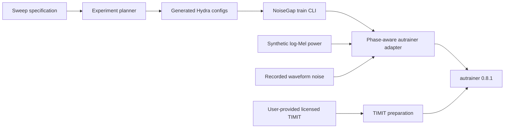

# NoiseGap

NoiseGap is an auditable experiment layer for measuring how a classifier trained
under one log-Mel noise condition behaves under another.

It also contains a separate controlled SpeechCommands protocol where CNN10 and
AST receive the same 16 kHz waveform corruption before either model frontend.
The two protocols are intentionally not merged: log-Mel SNR and waveform SNR are
different experimental quantities.

## Evidence boundary

The historical files in the source repository do **not** validate this
implementation:

- `analysis_results/summary_report.txt` was generated on 2025-12-01 for SNR levels
  `[-20, 0, 20]`.
- Noise mixing changed after that report, on 2025-12-04, 2025-12-07, and
  2026-04-13.
- The later sweep uses `[-5, 0, 10, 20, 30, 40]`.
- The old recorded-noise code transposed time and mel semantics implicitly. It
  could hit the requested aggregate SNR while destroying the recorded temporal
  structure.

Therefore this repository currently makes no accuracy, robustness, or speedup
claim. New claims require fresh runs whose resolved config, code revision,
checkpoint, metrics, and analysis output are retained together.

Every training or evaluation run writes `noisegap_provenance.json` beside its
outputs. It records the resolved-config SHA-256, protocol fields, dependency
versions, Git revision, and whether the checkout was dirty.

## Architecture



The internal tensor contract is always `[channel, time, mel]`. Recorded waveform
noise is converted with the same pinned PANN log-Mel parameters as speech
(`16 kHz`, `512`-sample window, `160`-sample hop, `64` bins, `50–8000 Hz`) and
then mixed in linear-power space.

Reported SNR is a feature-space quantity: mean speech power divided by mean added
noise power over non-zero (non-padding) log-Mel bins. It is not waveform SNR.
Zero-padded frames remain byte-for-byte unchanged.

## Data policy

TIMIT is distributed by the Linguistic Data Consortium as `LDC93S1` under an LDC
user agreement. NoiseGap does not download or redistribute it. Supply a licensed
local copy:

```bash
uv sync --frozen
uv run noisegap-prepare-timit \
  --source /path/to/TIMIT \
  --output data/TIMIT-sentence-type

uv run autrainer preprocess \
  --config-dir conf \
  --config-name noisegap_base
```

The default split policy keeps the official TIMIT `TEST` tree as test data and
creates the development set from speakers in the official `TRAIN` tree. This is
not directly comparable with the legacy random 70/15/15 split over all speakers.

### Recovered article-compatible datasets

The original article used the legacy TIMIT sentence-type metadata and 16 kHz
preprocessed features from the ASL-ConNo experiments. Keep that dataset separate
from the safer official-TEST setup above. Locally, place or link its exact
`train.csv`, `dev.csv`, `test.csv`, `default/`, and `log_mel_16k/` artifacts under
`data/TIMIT-sentence-type-article`. The dedicated
`TIMIT-sentencetype-article-16k` config prevents silently mixing the two split
policies.

SpeechCommands uses autrainer's built-in v0.02 preparation, which preserves the
official training, validation, and testing lists. Recreate the article's 16 kHz
64-bin PANN log-Mel input with:

```bash
uv run autrainer fetch -cn noisegap_article_speechcommands
uv run autrainer preprocess -cn noisegap_article_speechcommands \
  +preprocessing=log_mel_16k
```

Generate the feature-space article matrix for either dataset without changing
the controlled waveform experiment:

```bash
uv run noisegap-generate \
  --base-config noisegap_article_timit \
  --seed 0 \
  --output generated/article-timit \
  --recorded-root data/AudioSet-Balanced-Noise \
  --recorded-train-csv data/AudioSet-Balanced-Noise/train.csv \
  --recorded-dev-csv data/AudioSet-Balanced-Noise/dev.csv \
  --recorded-test-csv data/AudioSet-Balanced-Noise/test.csv

uv run noisegap-generate \
  --base-config noisegap_article_speechcommands \
  --seed 0 \
  --output generated/article-speechcommands \
  --recorded-root data/AudioSet-Balanced-Noise \
  --recorded-train-csv data/AudioSet-Balanced-Noise/train.csv \
  --recorded-dev-csv data/AudioSet-Balanced-Noise/dev.csv \
  --recorded-test-csv data/AudioSet-Balanced-Noise/test.csv
```

These commands reproduce the article's feature-space question. The separate
`noisegap-generate-speechcommands` command remains the CNN10 waveform-level
confound-control experiment.

For a historical reproduction of the published CNN10 result, including the
article implementation rather than the corrected feature mixer, add:

```bash
uv run noisegap-generate \
  --base-config noisegap_article_timit \
  --feature-implementation article_legacy \
  --seed 0 \
  --output generated/timit-feature-cnn10-article-legacy-seed0 \
  --recorded-root data/AudioSet-Balanced-Noise \
  --recorded-train-csv data/AudioSet-Balanced-Noise/train.csv \
  --recorded-dev-csv data/AudioSet-Balanced-Noise/dev.csv \
  --recorded-test-csv data/AudioSet-Balanced-Noise/test.csv
```

This compatibility mode deliberately retains the historical `abs(randn)`
Gaussian power field, torchaudio MelSpectrogram defaults for recorded noise,
the legacy 64-frame resize caused by the old time/mel interpretation, and the
training-noise manifest for development. It is a reproduction control, not the
recommended implementation. The default `corrected` mode keeps the canonical
`[channel,time,mel]` layout, matched PANN parameters, and separate train/dev/test
noise manifests.

After running separate feature-space outputs for seeds 0, 1, and 2, aggregate
them without manually concatenating CSV files:

```bash
uv run noisegap-aggregate-seeds \
  --input generated/timit-feature-cnn10-article-legacy-seed0/summary.csv \
          generated/timit-feature-cnn10-article-legacy-seed1/summary.csv \
          generated/timit-feature-cnn10-article-legacy-seed2/summary.csv \
  --output generated/timit-feature-cnn10-article-legacy-summary-by-seed.csv
```

For every completed cell, independently reconstruct the confusion matrix from
the test manifest and saved predictions, verify Accuracy/UAR/Macro-F1 against
the holistic metrics, and flag predictions concentrated in one class:

```bash
uv run noisegap-diagnose \
  --manifest generated/timit-feature-cnn10-article-legacy-seed0/manifest.json \
             generated/timit-feature-cnn10-article-legacy-seed1/manifest.json \
             generated/timit-feature-cnn10-article-legacy-seed2/manifest.json \
  --output generated/timit-feature-cnn10-article-legacy-diagnostics.csv \
  --collapse-threshold 0.9
```

Historical runs predate raw-prediction hashes and are marked
`test_results_provenance_verified=False`; their recomputed metrics must still
match the hashed holistic artifact exactly. New runs hash the raw prediction,
target, output, index, and loss arrays and can be checked with
`--require-hashed-predictions`.

Generated feature-space configs set PyTorch intra-op and inter-op CPU threads to
one while retaining the article's single-process DataLoader. This removes severe
small-tensor thread-pool overhead without changing sample order or random-number
streams; the effective values are recorded in run provenance.

For the article-compatible TIMIT split with CNN10 waveform corruption, keep the
same two noise domains, six train/test SNRs, optimizer, learning rate, 15-epoch
budget, and three independent seeds. The only intended methodological change is
that noise is mixed with each original 16 kHz utterance before zero-padding,
resampling, and the PANN frontend:

```bash
uv run noisegap-generate-waveform \
  --output generated/timit-waveform-cnn10 \
  --base-config noisegap_article_timit_waveform \
  --dataset-label TIMIT-Sentence-Type-legacy-split \
  --recorded-label AudioSetBalancedWaveform \
  --recorded-root data/AudioSet-Balanced-Noise \
  --recorded-train-csv data/AudioSet-Balanced-Noise/train.csv \
  --recorded-dev-csv data/AudioSet-Balanced-Noise/dev.csv \
  --recorded-test-csv data/AudioSet-Balanced-Noise/test.csv \
  --models cnn10 \
  --seeds 0 1 2 \
  --train-snr -5 0 10 20 30 40 \
  --test-snr -5 0 10 20 30 40 \
  --noise-order -105 \
  --iterations 15
```

The recovered longest waveform has 124621 samples at 16 kHz, which becomes the
same 779-frame CNN10 input length used by the article. Applying noise before the
padding transform prevents artificial padded tails from changing the requested
utterance-level waveform SNR.

Training corruption follows the run seed. Development and test use distinct,
fixed corruption seeds across all model-training seeds, so model variance is not
confounded with different evaluation noise and checkpoint selection does not
reuse the final-test realization.

Recorded-noise WAV files are likewise user-supplied and are never downloaded or
redistributed. Train, development, and test use separate manifests so checkpoint
selection never observes final-test noise files. Each CSV must contain one unique
`path` per row, relative to `--recorded-root`; missing, duplicate, absolute, or
escaping paths fail closed.

## Generate an experiment matrix

```bash
uv run noisegap-generate \
  --output generated/audioset \
  --recorded-root data/AudioSet-Balanced-Noise \
  --recorded-train-csv data/AudioSet-Balanced-Noise/train.csv \
  --recorded-dev-csv data/AudioSet-Balanced-Noise/dev.csv \
  --recorded-test-csv data/AudioSet-Balanced-Noise/test.csv
```

With two domains and six SNR levels this produces a manifest with 12 diagonal
training runs and 132 checkpoint-reuse evaluations. Generated files are ignored by
Git; the specification and generator are the source of truth. Each evaluation
config points directly to the `_best/model.pt` produced by its corresponding
diagonal training config.

Run a generated config by adding its directory to Hydra's search path:

```bash
uv run noisegap-train \
  --config-dir generated/audioset/configs \
  --config-name train_SS_train-5_test-5
```

Run this command from the repository root. From another working directory, set
`NOISEGAP_CONFIG_DIR` to the absolute path of this repository's `conf` directory.
Training configs must finish before evaluations that reference their checkpoint.
The generated `manifest.json` is train-first and gives every evaluation an
explicit `depends_on` training config.

Run the complete train-first DAG, or one phase:

```bash
uv run noisegap-run --manifest generated/audioset/manifest.json
uv run noisegap-run --manifest generated/audioset/manifest.json --phase train
uv run noisegap-run --manifest generated/audioset/manifest.json --phase evaluate
```

For a scheduler array, pass `--phase` and a zero-based `--index` (12 train
indices or 132 evaluation indices). Use `--dry-run` to print commands without
executing them. The runner refuses evaluation until its training checkpoint
exists and verifies that every successful training command produced one.

After the matrix completes, build a provenance-checked table:

```bash
uv run noisegap-summarize \
  --manifest generated/audioset/manifest.json \
  --output generated/audioset/summary.csv
```

The summarizer verifies resolved-config and test-artifact hashes and rejects an
incomplete matrix, missing Git revision, or dirty checkout by default.
`--allow-incomplete` and `--allow-uncommitted` are explicitly diagnostic; their
resulting tables must not be reported as a committed full-matrix result.

Evaluation outputs retain the resolved config, provenance, test metrics, outputs,
and timing, but do not duplicate model/optimizer states from the referenced
training run.

Automatic resume is disabled because a partially resumed run would weaken the
one-config/one-output provenance boundary. Remove or relocate an incomplete
generated result directory before retrying it.

## Controlled CNN10 versus AST waveform experiment

Fetch SpeechCommands v0.02 through autrainer's existing dataset path, then make
a file-disjoint train/test split of its bundled background-noise WAV files:

```bash
uv run autrainer fetch -cn noisegap_speechcommands
uv run autrainer fetch -cn noisegap_speechcommands model=ASTModel-T-waveform
uv run noisegap-prepare-speechcommands-noise
```

The background-noise split is by source file, not by random crop. This prevents
the same long source recording from appearing in both noise manifests. It is a
controlled in-dataset noise condition, not evidence of generalization to unseen
real-world corpora such as MUSAN or DEMAND.

Generate the headline matrix:

```bash
uv run noisegap-generate-speechcommands \
  --output generated/speechcommands-waveform \
  --models cnn10 ast \
  --seeds 0 1 2 \
  --train-snr 20 \
  --test-snr -5 0 10 20 30 40
```

This produces 12 training runs and 132 checkpoint-reuse evaluations. Every raw
clip is corrupted at 16 kHz before either frontend:

```text
raw SpeechCommands waveform
  -> waveform noise at mean-square SNR (no clipping)
     -> resample to 32 kHz -> PANN log-Mel -> CNN10
     -> AST feature extractor at 16 kHz -> AST
```

Training noise uses the run seed. Development and test noise are deterministic
per item with evaluation seed 0, so CNN10 and AST receive identical evaluation
corruptions for the same item/domain/SNR. CNN10 and AST keep their own pretrained
frontends and optimization settings; this removes the injection-space confound
but does not make the full architectures identical.

Run one bounded GPU smoke before scheduling the full matrix:

```bash
uv run noisegap-run \
  --manifest generated/speechcommands-waveform/manifest.json \
  --phase train --index 0 \
  iterations=1
```

After all runs finish, validate provenance and aggregate the independent seeds:

```bash
uv run noisegap-summarize \
  --manifest generated/speechcommands-waveform/manifest.json \
  --output generated/speechcommands-waveform/summary.csv

uv run noisegap-aggregate-seeds \
  --input generated/speechcommands-waveform/summary.csv \
  --output generated/speechcommands-waveform/summary-by-seed.csv
```

The aggregate retains every seed value and reports the mean, sample standard
deviation, minimum, and maximum. With only three seeds, individual points and
standard deviations should remain visible; a narrow-looking confidence interval
must not be overinterpreted.

## Verification

```bash
uv run ruff check .
uv run pytest
```

The tests check the requested SNR on non-padded frames, preserve zero padding,
enforce the `[channel, time, mel]` boundary, verify deterministic evaluation noise,
validate the 12/132 matrix, and test speaker-disjoint TIMIT preparation.
