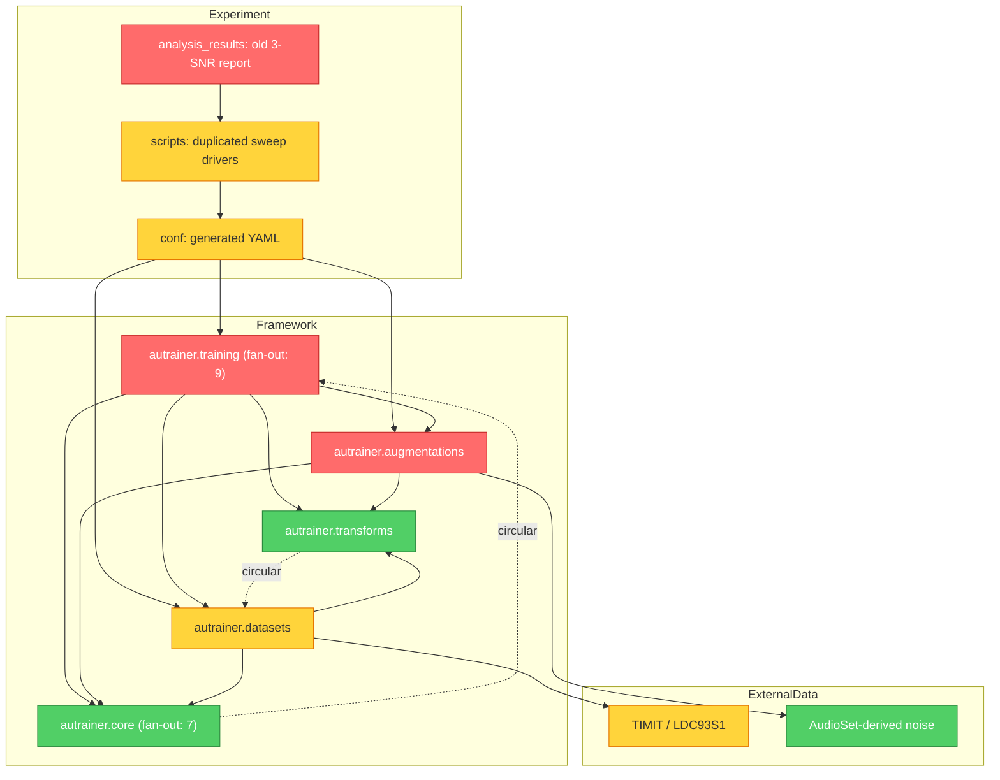

# Brooks-Lint Review

**Mode:** Architecture Audit
**Scope:** `yiyi-cs/ASL-ConNo@f46af323`, full project with direct source,
history, config, test, and runtime inspection
**Health Score:** 33/100

Исследовательский прототип содержит рабочие идеи, но его текущая структура не
поддерживает проверяемое утверждение, что сохранённые результаты относятся к
текущему коду и текущему шеститочечному протоколу.

---

## Module Dependency Graph

---

## Findings

### 🔴 Critical

**Domain Model Distortion — recorded-noise axes are swapped**
Symptom: PANN input is `[channel,time,mel]`, while torchaudio noise is
`[channel,mel,time]`; the implementation crops the last axis to 64 and bilinearly
resizes the former mel axis to the padded time length. A direct check still measured
the requested aggregate SNR, so an SNR-only test cannot detect the corruption.
The noise extractor also uses torchaudio defaults while speech uses the PANN
filterbank with `fmin=50` and `fmax=8000`, so matching shapes do not mean matching
mel coordinates.
Source: Domain-Driven Design — Ubiquitous Language; A Philosophy of Software
Design — Information Leakage.
Consequence: the experiment is described as using recorded temporal noise, but the
code destroys that temporal layout before mixing and compares power in different
feature systems.
Remedy: make `[channel,time,mel]` a checked boundary, transpose once after Mel
extraction, use the same PANN parameters for speech and noise, and prohibit
implicit frequency resizing.

**Change Propagation — trainer schema breaks the upstream contract**
Symptom: `ModularTaskTrainer` unconditionally requires `train_augmentation` and
`test_augmentation`; the upstream Toy configuration fails with `Missing key
train_augmentation`. Development augmentation is hard-wired to training
augmentation.
Source: Refactoring — Shotgun Surgery; Clean Architecture — Dependency Inversion
Principle.
Consequence: generic autrainer workflows fail, and checkpoint selection can occur
on a different corruption domain from the intended evaluation.
Remedy: isolate phase-aware behavior in one adapter with explicit train/dev/test
fields and retain legacy single-augmentation compatibility.

**Knowledge Duplication — results and current protocol have different provenance**
Symptom: the committed report was generated before three later noise-code changes
and covers `[-20,0,20]`, while current drivers and analysis expect
`[-5,0,10,20,30,40]`.
Source: The Pragmatic Programmer — DRY; Software Engineering at Google —
Hyrum's Law.
Consequence: historical accuracy numbers cannot validate the current implementation
or matrix.
Remedy: bind each report to code revision, resolved configs, checkpoint identities,
and raw result paths; publish no new claim until rerun.

### 🟡 Warning

**Accidental Complexity — generated files are treated as source**
Symptom: the branch adds 386 files and 22,023 lines, dominated by hundreds of YAML
files and several near-duplicate 400-line shell drivers.
Source: Refactoring — Duplicate Code; A Philosophy of Software Design — Tactical
Programming.
Consequence: changing one SNR level or domain requires broad regeneration and makes
the canonical protocol ambiguous.
Remedy: keep one typed matrix specification and generate ignored configs plus a
manifest.

**Domain Model Distortion — TIMIT acquisition and split policy are implicit**
Symptom: code downloads a supposed TIMIT archive from an unofficial Google Drive
location and then randomizes all speakers into 70/15/15, disregarding the official
TRAIN/TEST partition. The locked environment downloaded HTML and raised
`BadZipFile`.
Source: Domain-Driven Design — Bounded Context; Software Engineering at Google —
Dependency Management.
Consequence: the workflow is not reproducible, is not directly comparable with the
standard split, and crosses a licensed-data boundary.
Remedy: require a user-provided licensed LDC93S1 copy and record the split policy in
a manifest.

**Testability Seam — project-specific behavior has no pytest coverage**
Symptom: no test file changed on the baseline branch; new noise classes, eval-only
training, TIMIT preparation, and config generation are absent from the suite.
Source: Working Effectively with Legacy Code — Seams and Characterization Tests.
Consequence: the source suite reported 45 failures and the project-specific
verification scripts used the wrong feature orientation.
Remedy: test pure power mixing, axis contracts, padding, deterministic evaluation,
matrix counts, split ownership, and the trainer compatibility boundary.

**Dependency Disorder — locked audio loading is incomplete**
Symptom: the frozen environment resolves a torchaudio version whose load path
requires undeclared `torchcodec`; `CrossDomainNoise` fails before mixing.
Source: Software Engineering at Google — Dependency Management.
Consequence: the recorded-noise path is not runnable from the repository lock.
Remedy: use the already-declared `audiofile` decoder and reserve torchaudio for
resampling and transforms, or explicitly pin and test the codec dependency.

### 🟢 Suggestion

**Cognitive Overload — research naming leaks implementation history**
Symptom: names such as `SNR_noise`, `StaticGaussian`, `A_*`, and `R_*` combine
mechanism, scheduling behavior, and batch provenance.
Source: Code Complete — The Power of Variable Names; Domain-Driven Design —
Ubiquitous Language.
Consequence: readers must inspect code and scripts to learn whether corruption is
waveform- or feature-space and whether it is deterministic.
Remedy: use names such as `SyntheticLogMelNoise`, `RecordedLogMelNoise`, and
`deterministic_per_item`.

**Conway's Law:** team ownership information is unavailable, so no organizational
finding is asserted.

---

## Summary

Сначала необходимо восстановить честную цепочку
`specification → generated config → resolved run config → checkpoint → raw metric →
report`. Архитектурная версия NoiseGap должна быть тонким проверяемым слоем над
закреплённым autrainer, а не ещё одной копией всего фреймворка.
